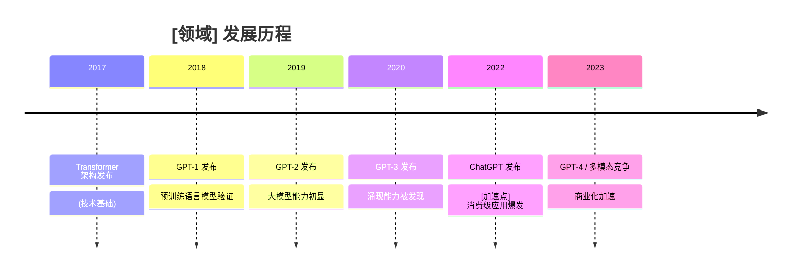

# Step 5: 时间线构建器

## 目标

帮助用户从资料中提取时间信息，构建领域发展历程的完整脉络，识别关键转折点。

## 何时执行

**必须执行的情况：**
- 资料涉及历史发展、技术演进、行业变迁
- 用户问"这是如何发展到今天的"
- 需要理解某个现象的因果关系链
- 资料包含多个时间点的事件

**核心价值：**
将零散的时间信息整合为连贯的叙事，揭示"为什么现在是这样"。

## 执行流程

### 1. 时间信息提取

从资料中识别所有时间相关元素：

**显性时间标记：**
- 具体日期（2023 年 6 月）
- 年份（2019）
- 时期（"互联网泡沫时期"、"疫情期间"）
- 相对时间（"3 年后"、"此前"）

**隐性时间线索：**
- "首次"、"最早"、"开创性"
- "随着...的发展"
- "转折点"、"分水岭"
- 技术版本迭代（iPhone 4 → 5 → 6）

### 2. 事件分类

将提取的事件按类型分类：

| 事件类型 | 说明 | 示例 |
|---------|-----|------|
| 技术突破 | 核心技术/方法的诞生或重大改进 | Transformer 架构发布 |
| 产品发布 | 具有影响力的产品/服务问世 | ChatGPT 发布 |
| 里程碑事件 | 标志性的成就或数据 | 模型突破 100B 参数 |
| 政策/法规 | 监管环境变化 | GDPR 生效 |
| 市场变化 | 市场规模、格局变动 | 某技术商业化 |
| 认知转变 | 观念、范式变化 | 从符号主义到连接主义 |

### 3. 时间线构建

按时间顺序排列事件，注意：

**绝对时间 vs 相对时间：**
- 有具体日期的直接标注
- 相对时间（"X 年后"）需要锚定参考点

**并行事件：**
- 同一时期多个独立发展线
- 用分支表示并行线索

**因果关系标注：**
- 事件 A → 导致 → 事件 B
- 用箭头标注因果链条

### 4. 加速点识别

找出发展显著加速的节点：

**加速信号：**
- 事件密度突然增加
- 突破性成果集中出现
- 资本/关注度陡增
- 应用爆发

**分析维度：**
- 是什么触发了加速？（技术成熟？资本涌入？）
- 加速前有哪些铺垫？
- 加速带来了什么变化？

### 5. 阶段划分

根据发展特征将时间线划分为阶段：

```
阶段 1：萌芽期 (Year X - Year Y)
- 特征：...
- 关键事件：...

阶段 2：成长期 (Year Y - Year Z)
- 特征：...
- 关键事件：...
```

阶段划分标准：
- 技术代际更替
- 主导玩家变化
- 应用场景扩展
- 市场规模跃迁

## 输出格式

```markdown
## 发展历程时间线

### 完整时间线



### 阶段划分

#### 阶段 1：理论基础期 (2017-2018)
**特征**：架构创新，概念验证
**关键事件**：
- 2017.06 Transformer 论文发表
- 2018.06 GPT-1 发布

#### 阶段 2：能力探索期 (2019-2021)
**特征**：规模扩展，能力边界探索
**关键事件**：...

#### 阶段 3：应用爆发期 (2022-至今)
**特征**：[加速点] 从实验室走向大众
**关键事件**：...

### 关键转折点分析

#### 转折点 1：[事件名称] ([年份])
- **前因**：...
- **后果**：...
- **为什么是关键点**：...

### 并行发展线索

如有多条发展线，分别列出：
- 技术演进线：...
- 商业应用线：...
- 监管政策线：...

### 因果链条

```
A → B → C → D

说明：
- A 如何导致 B：...
- B 到 C 的关键因素：...
```

### 时间线洞察

1. **发展模式**：渐进式 vs 跃迁式？
2. **关键驱动因素**：技术？资本？政策？
3. **当前所处阶段**：萌芽/成长/成熟/衰退？
4. **预测未来走向**：基于历史模式的推测
```

## 提示词

**中文：**
```
从这些资料中提取所有日期、事件、里程碑和时间参考信息。构建一个全面的时间线，展示该领域/主题的发展历程。找出进展显著加速的节点。

输出要求：
1. 完整时间线（按时间顺序，包含所有关键事件）
2. 阶段划分（按特征将发展历程分段）
3. 加速点分析（识别并解释发展加速的节点）
4. 因果关系链（标注关键事件之间的因果联系）
5. 多线并行发展（如有多个独立线索）
6. 基于时间线的洞察和预测
```

**English:**
```
Extract every date, event, milestone, and temporal reference from these sources. Build a comprehensive timeline showing how this field/topic evolved. Identify acceleration points where progress dramatically increased.

Output requirements:
1. Complete timeline (chronological, all key events)
2. Phase division (segment by characteristics)
3. Acceleration point analysis (identify and explain)
4. Causal chains (annotate connections between events)
5. Parallel development threads (if multiple tracks)
6. Timeline-based insights and predictions
```

## 执行技巧

### 处理不完整信息
当资料时间信息不完整时：
- 标注"资料未明确时间"
- 根据上下文推测大致时期
- 建议用户补充特定时间点

### 多源整合
对比多个资料的时间线：
- 识别一致的事件序列
- 标记有争议的时间点
- 解释为什么会有不同说法

### 深度 vs 广度
根据用户需求调整：
- 概览需求：突出关键转折点
- 深度需求：详细到月/日级别

## 常见错误

- **因果倒置**：确保时间顺序正确
- **忽视前置条件**：重大事件通常有长期铺垫
- **过度简化**：复杂发展往往不是单线性的