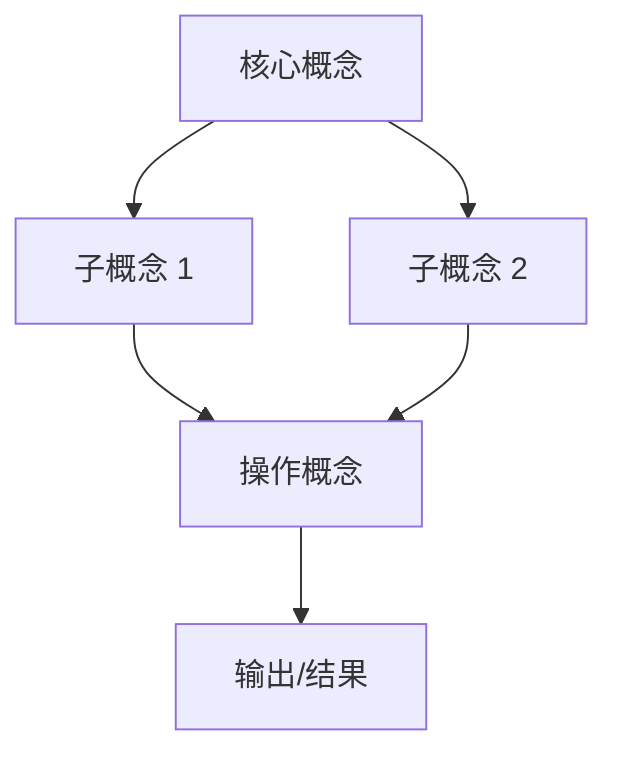

# Step 7: 建立内容框架

## 目标

帮助用户将资料中的零散概念整合为结构化的认知框架，形成可复用的思维工具。

## 何时执行

**必须执行的情况：**
- 资料包含多个相关概念需要整合
- 用户需要"系统化"的理解
- 需要建立概念之间的关系图谱
- 用户问"如何把零散信息变成体系"

**核心价值：**
将碎片化知识转化为结构化认知，便于记忆、应用和传授。

## 执行流程

### 1. 概念提取

从资料中识别所有关键概念：

**概念类型：**
- **核心概念**：主题的中心思想
- **子概念**：支撑核心概念的组成部分
- **关联概念**：与主题相关的外部概念
- **操作概念**：方法论、技术、工具
- **元概念**：关于概念的概念（分类、标准）

### 2. 关系识别

确定概念之间的关系类型：

| 关系类型 | 符号 | 示例 |
|---------|-----|------|
| 组成/包含 | ◇→ | 系统 → 组件 |
| 因果 | → | A 导致 B |
| 依赖 | ⇢ | A 依赖 B |
| 对立/互补 | ↔ | 计划 vs 市场 |
| 层级 | ↑ | 具体 → 抽象 |
| 时间先后 | ⟹ | 阶段 1 → 阶段 2 |
| 影响 | ⇝ | A 影响 B（程度可变）|

### 3. 框架类型选择

根据资料特性选择合适的框架结构：

**A. 层级框架（金字塔型）**
- 适用：有明确层级关系的领域
- 结构：顶层概念 → 中层 → 底层
- 示例：战略 → 战术 → 执行

**B. 流程框架（线性型）**
- 适用：有先后顺序的过程
- 结构：步骤 1 → 步骤 2 → 步骤 3
- 示例：输入 → 处理 → 输出

**C. 网络框架（图谱型）**
- 适用：多因素相互关联的复杂系统
- 结构：节点 + 多类型边
- 示例：生态系统关系图

**D. 矩阵框架（表格型）**
- 适用：多维度交叉分析
- 结构：维度 A × 维度 B
- 示例：重要性 × 紧迫性矩阵

**E. 对比框架（二分型）**
- 适用：需要区分不同模式的场景
- 结构：维度两端 + 中间状态
- 示例：探索 vs 利用

### 4. 决策树构建

如果资料涉及判断或选择，构建决策树：

```
问题/场景
├── 条件 A？
│   ├── 是 → 策略 X
│   └── 否 → 继续判断
└── 条件 B？
    ├── 是 → 策略 Y
    └── 否 → 策略 Z
```

### 5. 边界条件识别

明确框架的适用范围：

- **适用场景**：框架在什么情况下有效
- **不适用场景**：什么情况下会失效
- **边缘案例**：边界处的特殊情况
- **扩展方向**：框架可能如何演化

## 输出格式

```markdown
## 认知框架：【框架名称】

### 框架概述

**适用范围**：...
**核心功能**：帮助理解和应用 [主题] 的 [方面]

### 框架结构

#### 关键组成部分

| 组件 | 定义 | 作用 | 资料依据 |
|-----|-----|-----|---------|
| A | ... | ... | 第 X 章 |
| B | ... | ... | 第 Y 节 |

#### 组件关系图



关系说明：
- A → B：A 包含/产生 B
- B ↔ C：B 与 C 相互影响
- ...

### 应用决策树

```
【应用场景】
│
├── 条件 1：...？
│   ├── 是 → 采用 [策略 A]
│   └── 否 → 继续判断
│
├── 条件 2：...？
│   ├── 是 → 采用 [策略 B]
│   └── 否 → 采用 [策略 C]
│
└── 特殊情况：...
    └── 采用 [策略 D]
```

### 维度矩阵（如适用）

| | 维度 B-1 | 维度 B-2 | 维度 B-3 |
|--|---------|---------|---------|
| **维度 A-1** | 象限 1：... | 象限 2：... | ... |
| **维度 A-2** | 象限 3：... | 象限 4：... | ... |

各象限说明：
- 象限 1：特征...，适用策略...
- ...

### 框架边界

#### 适用条件
- 场景 1：...
- 场景 2：...

#### 不适用条件（框架失效）
- 边缘情况 1：...
  - 原因：...
  - 替代方案：...
- 边缘情况 2：...

#### 常见误用
- 误用 1：...（正确做法：...）
- 误用 2：...（正确做法：...）

### 框架应用示例

**示例 1**：...
应用过程：...
结果：...

**示例 2**：...
...

### 与其他框架的关系

- 与 [框架 X] 的区别：...
- 可以结合的框架：...
- 演化路径：...
```

## 提示词

**中文：**
```
创建一个综合框架，整合来自这些资料的所有概念。包括：关键组成部分、组成部分之间的关系、应用决策树以及框架失效的极端情况。

输出要求：
1. 框架命名和概述（适用范围、核心功能）
2. 关键组成部分清单（含定义、作用、资料依据）
3. 组件关系图（用 mermaid 或其他方式可视化）
4. 关系类型说明（明确每种关系的含义）
5. 应用决策树（何时用什么策略）
6. 维度矩阵（如适用，多维度交叉分析）
7. 框架边界（适用/不适用条件、边缘案例）
8. 应用示例（演示如何使用该框架）
```

**English:**
```
Create a comprehensive framework that integrates all concepts from these sources. Include: key components, relationships between components, decision trees for application, and edge cases where the framework breaks down.

Output requirements:
1. Framework name and overview (scope, core function)
2. Key component list (with definition, role, source reference)
3. Component relationship diagram (visualization)
4. Relationship type explanations
5. Application decision tree (when to use what strategy)
6. Dimensional matrix (if applicable, multi-dimensional analysis)
7. Framework boundaries (applicable/non-applicable conditions, edge cases)
8. Application examples (demonstrating framework usage)
```

## 执行技巧

### 框架命名
给框架一个简洁有力的名称，便于记忆和传播：
- 好："双金字塔模型"、"飞轮效应"、"增长黑客 AARRR"
- 差："综合框架 V1"、"基于 X 理论的模型"

### 层次清晰
确保框架有清晰的层次：
- 不要所有概念平铺
- 区分核心 vs 支撑
- 区分抽象 vs 具体

### 实用导向
框架最终要能用：
- 包含具体的应用指导
- 提供判断标准
- 说明常见错误

## 常见陷阱

- **过度复杂**：试图包含所有细节，失去简洁性
- **生搬硬套**：强行套用不合适的框架类型
- **忽视边界**：没有说明框架的局限性
- **缺乏可操作性**：只有概念，没有应用指导