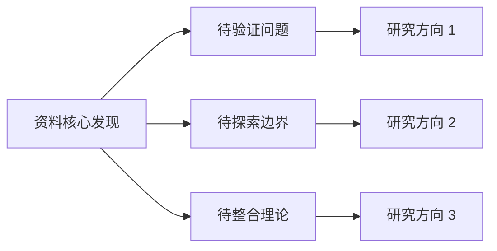

# Step 8: 专家级提问

## 目标

帮助用户发现资料未回答但专家会追问的关键问题，揭示知识边界和研究方向。

## 何时执行

**必须执行的情况：**
- 用户需要了解"我们还不知道什么"
- 资料将作为研究起点而非终点
- 需要识别进一步探索的方向
- 用户问"这些资料没讲什么重要问题"

**核心价值：**
从"已知"转向"未知"，从"消费信息"转向"提出问题"。

## 执行流程

### 1. 问题类型识别

专家会问的问题通常属于以下类别：

| 问题类型 | 说明 | 示例 |
|---------|------|------|
| 机制追问 | 现象背后的因果机制 | "为什么X会导致Y？" |
| 边界探索 | 结论的适用范围 | "在什么条件下这个规律失效？" |
| 反事实思考 | 如果没有X会怎样 | "如果没有政策干预，结果会不同吗？" |
| 长期影响 | 时间维度上的后果 | "5年后这个趋势会如何演变？" |
| 副作用/外部性 |  unintended consequences | "这个解决方案会带来什么新问题？" |
| 测量/验证 | 如何确认或证伪 | "如何设计实验来验证这个论断？" |
| 整合/冲突 | 与其他知识的关系 | "这个发现如何与Y理论协调？" |
| 行动指导 | 如何应用 | "在实践中如何权衡这些因素？" |

### 2. 提问策略

**逆向追问法：**
- 资料说X导致Y → 问"为什么X能导致Y？中介机制是什么？"
- 资料说X很重要 → 问"如果没有X，会怎样？"
- 资料说应该做X → 问"做X的代价是什么？"

**边界探测法：**
- 资料说"通常" → 问"例外情况是什么？"
- 资料给平均值 → 问"分布的尾部呢？"
- 资料基于某样本 → 问"其他人群呢？"

**时间延展法：**
- 资料描述现状 → 问"如何发展到这里的？"（追溯过去）
- 资料预测未来 → 问"什么会改变这个预测？"（展望未来）
- 资料说"新"发现 → 问"为什么之前没发现？"（理解时机）

**系统思考法：**
- 资料关注某因素 → 问"系统中还有哪些关键因素？"
- 资料线性因果 → 问"反馈循环是什么？"
- 资料静态分析 → 问"动态演化会怎样？"

### 3. 问题质量评估

好的专家级问题具备：

- **推动性**：能推动领域向前发展
- **可研究性**：理论上可以回答（即使现在不能）
- **重要性**：答案会影响核心理解或实践
- **未被回答**：资料确实没有涉及

### 4. 优先级排序

生成 15 个问题后，按重要性排序：

**Tier 1（最高优先级）**：
- 直接挑战核心论断
- 如果回答会显著改变理解
- 对实践有直接影响

**Tier 2（重要）**：
- 完善现有理解
- 探索边界条件
- 连接不同子领域

**Tier 3（有价值）**：
- 有趣的延伸问题
- 方法学改进
- 细节深化

## 输出格式

```markdown
## 专家级提问：未解答的关键问题

### 基于资料的分析前提

资料已回答的核心问题：
1. ...
2. ...

资料的知识边界：...

---

### Tier 1：最高优先级问题（直接影响核心理解）

#### 问题 1：[问题陈述]
**问题类型**：[机制/边界/反事实/...]
**为什么重要**：...
**与资料核心论断的关系**：...
**可能的研究方向**：...

#### 问题 2：...
...

---

### Tier 2：重要问题（完善和扩展理解）

#### 问题 4：...
...

---

### Tier 3：有价值的问题（细节和方法学）

#### 问题 11：...
...

---

### 问题分类统计

| 类型 | 数量 | 代表问题 |
|-----|-----|---------|
| 机制追问 | X | 问题 1, ... |
| 边界探索 | X | 问题 3, ... |
| 反事实思考 | X | ... |
| ... | ... | ... |

### 研究机会图谱



### 用户行动建议

基于这些问题，用户可以选择：
1. **深入研究**：选择 Tier 1 问题进行文献检索
2. **谨慎应用**：在边界问题未明确前，限定应用范围
3. **关注进展**：跟踪这些问题的最新研究动态
```

## 提示词

**中文：**
```
基于这些资料，提出15个专家会问但这些资料没有回答的问题。优先考虑那些能够推动该领域发展或揭示当前理解中关键空白的问题。

输出要求：
1. 先总结资料已回答的问题（作为对比基准）
2. 15 个专家级问题，分三级优先级：
   - Tier 1（5个）：最高优先级，直接影响核心理解
   - Tier 2（5个）：重要，完善和扩展理解
   - Tier 3（5个）：有价值，细节和方法学
3. 每个问题包含：问题陈述、类型标签、重要性说明、与资料的关系
4. 问题分类统计（按类型）
5. 研究机会图谱（可视化问题之间的关系）
6. 用户行动建议（如何利用这些问题）
```

**English:**
```
Based on these sources, generate 15 questions that an expert would ask but that these sources DON'T answer. Prioritize questions that would advance the field or reveal critical gaps in current understanding.

Output requirements:
1. Summarize what questions the sources HAVE answered (as baseline)
2. 15 expert-level questions, prioritized in three tiers:
   - Tier 1 (5): Highest priority, directly impact core understanding
   - Tier 2 (5): Important, refine and extend understanding
   - Tier 3 (5): Valuable, details and methodology
3. Each question includes: statement, type tag, importance explanation, relation to sources
4. Question category statistics (by type)
5. Research opportunity map (visualize relationships between questions)
6. Action recommendations for the user (how to leverage these questions)
```

## 执行检查清单

- [ ] 是否生成了恰好 15 个问题？
- [ ] 是否按重要性分三级？
- [ ] 每个问题是否都被资料明确遗漏？
- [ ] 问题是否具有专家水准（非简单疑问）？
- [ ] 是否说明了每个问题的重要性？
- [ ] 是否提供了用户行动建议？

## 常见陷阱

- **问题太泛**："未来会怎样？"（需要具体化）
- **问题已回答**：资料其实已经涉及但没仔细看
- **问题不可研究**："生命的意义是什么？"
- **忽视优先级**：把重要和不重要的问题混在一起

## 示例对比

**差示例**：
- "这个技术好不好？"（主观、笼统）
- "作者是谁？"（信息性问题，非专家级）

**好示例**：
- "该技术在边缘设备上的性能衰减曲线是怎样的？什么硬件阈值下变得不可行？"
- "如果训练数据中的偏见被完全消除，模型的公平性提升上限是多少？"