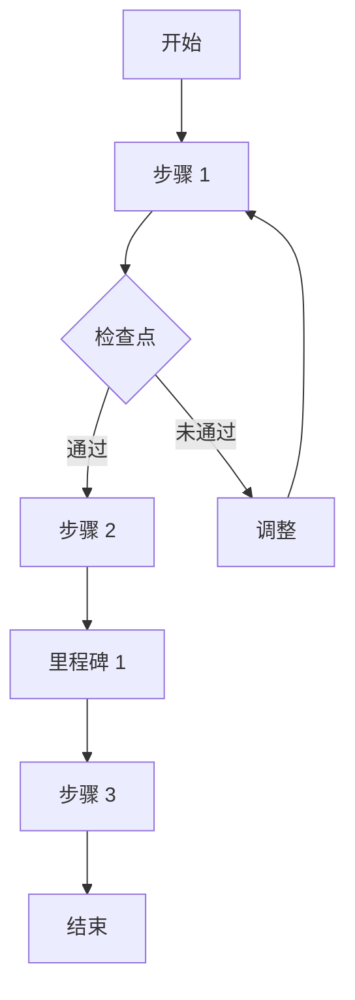

# Step 9: 实施蓝图计划

## 目标

帮助用户将资料中的知识转化为可执行的行动计划，明确步骤、工具和风险。

## 何时执行

**必须执行的情况：**
- 用户问"接下来该怎么做"
- 资料包含方法论或最佳实践
- 需要将理论转化为操作指南
- 用户准备基于资料开始项目/改变做法

**核心价值：**
从"知道"到"做到"，填补知识与实践之间的鸿沟。

## 执行流程

### 1. 可执行元素提取

从资料中提取所有行动相关内容：

**提取清单：**
- 具体步骤或阶段
- 推荐的工具/软件/平台
- 方法论或框架
- 技术或技巧
- 检查点或里程碑
- 成功标准或指标
- 常见错误/陷阱
- 资源需求（时间/资金/人力）

### 2. 步骤结构化

将提取的元素组织为可执行流程：

**步骤属性定义：**

| 属性 | 说明 | 示例 |
|-----|------|------|
| 步骤名称 | 简洁的动作描述 | "完成用户调研" |
| 前提条件 | 开始前需要什么 | "已确定目标用户群" |
| 具体动作 | 详细操作说明 | "访谈 5 位目标用户" |
| 所需资源 | 时间/工具/人力 | "2 周，访谈提纲" |
| 预期产出 | 完成后的成果 | "用户画像文档" |
| 验收标准 | 怎么算完成 | "获得 3 个关键痛点" |
| 潜在风险 | 可能遇到的问题 | "用户招募困难" |
| 应对策略 | 风险怎么解决 | "准备备选招募渠道" |

### 3. 依赖关系梳理

确定步骤之间的先后顺序和依赖：

**依赖类型：**
- **强依赖**：必须完成 A 才能开始 B
- **弱依赖**：A 有助于 B，但不是必须
- **并行**：可以和其它步骤同时进行
- **循环**：需要迭代（A→B→A）

### 4. 工具与资源整合

整理每个步骤所需的工具和参考资料：

| 步骤 | 必需工具 | 可选工具 | 学习资源 |
|-----|---------|---------|---------|
| 1 | ... | ... | ... |
| 2 | ... | ... | ... |

### 5. 风险与缓解策略

识别实施过程中的风险点：

**风险分类：**
- **技术风险**：技术不可行、性能不达标
- **资源风险**：时间/预算超支、人手不足
- **市场风险**：需求变化、竞争加剧
- **执行风险**：团队能力不足、协作问题

**缓解策略模板：**
- 风险 X 发生概率 [高/中/低]，影响 [严重/中等/轻微]
- 早期预警信号：...
- 缓解措施：...
- 应急预案：...

### 6. 进度与里程碑

设定检查点和里程碑：

- **里程碑**：关键成果完成点
- **检查点**：进度评审时机
- **退出条件**：什么情况下应该停止

## 输出格式

```markdown
## 实施蓝图计划

### 项目概述

**目标**：[基于资料要达成什么]
**适用场景**：[在什么情况下使用这个计划]
**预计周期**：[总时间]
**所需资源**：[人力/资金/工具]

---

### 实施步骤

#### 阶段 1：[阶段名称]（预计 X 天/周）

##### 步骤 1.1：[步骤名称]
- **前提条件**：...
- **具体动作**：
  1. ...
  2. ...
- **所需资源**：...
- **预期产出**：...
- **验收标准**：...
- **潜在风险**：...
- **应对策略**：...

##### 步骤 1.2：...
...

#### 阶段 2：...
...

---

### 流程图



---

### 工具与资源清单

#### 必需工具
| 工具 | 用途 | 获取方式 | 成本 |
|-----|-----|---------|-----|
| ... | ... | ... | ... |

#### 推荐学习资源
- [资源 1]：...
- [资源 2]：...

---

### 风险管理计划

| 风险 | 概率 | 影响 | 早期信号 | 缓解措施 | 应急预案 |
|-----|-----|-----|---------|---------|---------|
| 风险 1 | 高/中/低 | 严重/中/轻 | ... | ... | ... |

---

### 里程碑与检查点

#### 里程碑
- **M1**：[描述] - 预计时间 - 成功标准
- **M2**：...

#### 检查点
- **C1**：[时间点] - 检查内容 - Go/No-go 标准
- **C2**：...

#### 退出条件
在以下情况下应暂停或终止项目：
1. ...
2. ...

---

### 成功指标（KPI）

如何衡量实施成功：
- 指标 1：...
- 指标 2：...

---

### 常见问题与解答

**Q1**：...
**A**：...

**Q2**：...
**A**：...
```

## 提示词

**中文：**
```
提取所有资料中提到的每一个可操作的步骤、工具、框架和技术。将它们整理成一个循序渐进的实施计划，每个步骤都应包含前提条件、预期结果和潜在风险。

输出要求：
1. 项目概述（目标、场景、周期、资源）
2. 分阶段实施步骤（每步包含：前提条件、具体动作、所需资源、预期产出、验收标准、风险、应对策略）
3. 流程图（可视化步骤依赖关系）
4. 工具与资源清单（必需/可选、获取方式、成本）
5. 风险管理计划（概率、影响、信号、缓解、应急）
6. 里程碑与检查点（含退出条件）
7. 成功指标（KPI）
8. 常见问题解答
```

**English:**
```
Extract every actionable step, tool, framework, and technique mentioned across all sources. Organize them into a step-by-step implementation plan with prerequisites, expected outcomes, and potential pitfalls for each step.

Output requirements:
1. Project overview (goal, scenario, timeline, resources)
2. Phased implementation steps (each with: prerequisites, actions, resources, deliverables, acceptance criteria, risks, mitigation)
3. Flowchart (visualize step dependencies)
4. Tools and resources list (required/optional, how to obtain, cost)
5. Risk management plan (probability, impact, signals, mitigation, contingency)
6. Milestones and checkpoints (with exit conditions)
7. Success metrics (KPIs)
8. FAQ
```

## 执行检查清单

- [ ] 是否提取了资料中的所有可执行元素？
- [ ] 步骤是否足够具体（可执行）？
- [ ] 每个步骤是否有明确的验收标准？
- [ ] 依赖关系是否清晰？
- [ ] 风险识别是否全面？
- [ ] 是否提供了应急预案？
- [ ] 工具/资源清单是否实用？

## 注意事项

- **保持现实**：不要承诺资料未保证的结果
- **考虑用户上下文**：根据用户情况调整建议（资源、经验等）
- **强调验证**：关键步骤建议先做小规模验证
- **留出调整空间**：计划应有灵活性，不是僵化的

## 示例对比

**差示例**：
- "做市场调研"（太笼统）
- "使用合适的工具"（不具体）

**好示例**：
- "通过 5 次深度用户访谈和 100 份问卷调研目标用户需求，产出用户画像和痛点优先级列表，预计 2 周完成"
- "使用 Figma 制作交互原型，推荐配合 Maze 进行可用性测试"