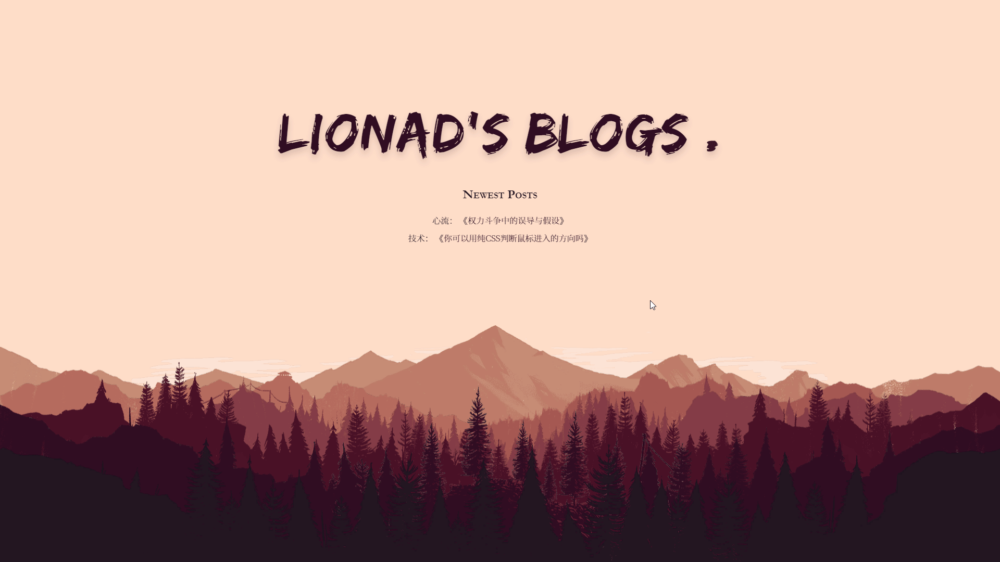
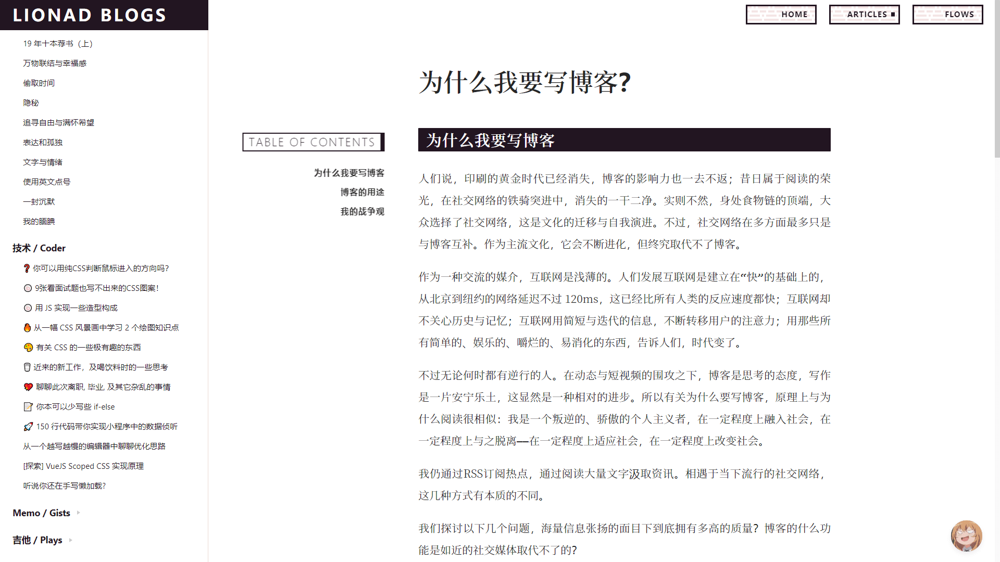

# Lionad's Blog

My personal websites，build with VuePress, you can visit at here: [http://www.lionad.art](http://www.lionad.art)

## Homepage



## Readpage



## Components

### Gestures

Catch mouse events, mousewheel events and mobile events.

* Usage

```HTML
<Gesture :swipeDown="() => {}" :swipeTopLeft="() => {}" freezeTime="300">
    <Children />
</Gesture>
```

* Props

```js
// gestures
{
    'tap',
    // 'longtap',
    // 'doubletap',
    // 'swipe',
    // 'swipeLeft',
    // 'swipeRight',
    'swipeUp',
    'swipeDown',
    // 'swipeTopLeft',
    // 'swipeTopRight',
    // 'swipeDownLeft',
    // 'swipeDownRight'
    // 'rotate'
}
// props
{
    freezeTime, // debounce time interval
    eventInvoke, // pass events to outside then do e.preventDefault or e.stopPropagation
}
```

### Sparkles

Create anything with bling-bling-stars.


* Usage

```HTML
<Spark>
    <Children />
</Spark>
```

* Props

```js
{
    color, // 星星的颜色，默认为黄色，可以传入颜色值或者 colors 对象内的键名，也支持直接传入数组
    minDelay, // 最小生成延迟
    maxDelay, // 最大生成延迟
}
```