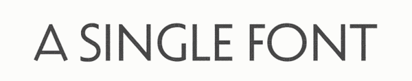

# CSS 中那些极其有趣的东西

## 自定义属性 / 变量

CSS 变量（官方叫做 Custom Properties，即自定义属性）是一个意义于作用同样强大的东西，它给 CSS 带来了原生层面意义上的代码模块化。我们可以通过浏览器 API 与 JavaScript 进行交互，使得其功效进一步扩大，同时提高 CSS 的可读性及维护性。通过给 CSS 变量赋任意有意义的值，并交由 calc 函数计算，可以产生具有可读性的组合值。比如下面这个例子：

```css
.my-component {
  --theme-color: red;
  --card-width: 30px;
}
.my-component .title {
  color: var(--my-component-theme-color);
}
.my-component .card-container {
  width: calc(var(--my-component-card-width) * 3);
  border: solid 1px var(--my-component-theme-color);
}
```

我们给组件（my-component）定义了主题色及卡片宽度两个变量，这两个变量可以在作用范围内任意使用及被改造。这两个变量也意味着组件的样式向外部暴露了两个可供修改的入口。一般而言，我们可以使用这两种方法继续扩展代码，以达到修改变量的目的：

```html
<link rel="stylesheet" href="my-component.css" />
<style>
  .my-component {
    --theme-color: gray;
  }
</style>
```

```JavaScript
const $con = document.querySelector('.my-component')
$con.style.setProperty('--theme-color', 'gray')
```

这里有一个能展示 CSS 变量超能力的极具吸引力的例子：

<p class="codepen" data-height="265" data-theme-id="dark" data-default-tab="css,result" data-user="danwilson" data-slug-hash="BRdJVZ" style="height: 265px; box-sizing: border-box; display: flex; align-items: center; justify-content: center; border: 2px solid; margin: 1em 0; padding: 1em;" data-pen-title="Single Div Accordion (Animated with CSS Variables)">
  <span>See the Pen <a href="https://codepen.io/danwilson/pen/BRdJVZ">
  Single Div Accordion (Animated with CSS Variables)</a> by Dan Wilson (<a href="https://codepen.io/danwilson">@danwilson</a>)
  on <a href="https://codepen.io">CodePen</a>.</span>
</p>
<script async src="https://static.codepen.io/assets/embed/ei.js"></script>

这个例子则通过结合 CSS 变量与媒体查询，展示了 CSS 变量在自适应布局中的强大能力：

<p class="codepen" data-height="265" data-theme-id="dark" data-default-tab="css,result" data-user="melnik909" data-slug-hash="qPjwvq" data-preview="true" style="height: 265px; box-sizing: border-box; display: flex; align-items: center; justify-content: center; border: 2px solid; margin: 1em 0; padding: 1em;" data-pen-title="CSS Timeline with Custom Properties">
  <span>See the Pen <a href="https://codepen.io/melnik909/pen/qPjwvq">
  CSS Timeline with Custom Properties</a> by Stas Melnikov (<a href="https://codepen.io/melnik909">@melnik909</a>)
  on <a href="https://codepen.io">CodePen</a>.</span>
</p>
<script async src="https://static.codepen.io/assets/embed/ei.js"></script>

## 灵活字体

<!-- > The future is variable, though the future is in the variable -->

灵活字体（Variable fonts）是一种包含字体元信息如字宽、字重（甚至自定义形变）的字体的字体方案。

一张图展示其迷人之处：



灵活字体主要通过使用 `font-variation-settings` 属性配置变形轴，来达到使字体形变的效果，如：

```CSS
h2 {
  font-size: 64px;
  font-variation-settings: 'wght' 375;
}

```

这里有一个展示其强大排版能力的示例页面：

<p class="codepen" data-height="265" data-theme-id="dark" data-default-tab="result" data-user="jpamental" data-slug-hash="wvwgGLK" style="height: 265px; box-sizing: border-box; display: flex; align-items: center; justify-content: center; border: 2px solid; margin: 1em 0; padding: 1em;" data-pen-title="Layout variations, part deux">
  <span>See the Pen <a href="https://codepen.io/jpamental/pen/wvwgGLK">
  Layout variations, part deux</a> by Jason Pamental (<a href="https://codepen.io/jpamental">@jpamental</a>)
  on <a href="https://codepen.io">CodePen</a>.</span>
</p>
<script async src="https://static.codepen.io/assets/embed/ei.js"></script>
