# 百度推广登录过程

## 调试小技巧

-css -js status-code:200

## 相关背景资料

页面入口的 JS 包代码顶部有 Weirwood 的版权字样。Weirwood 是一个 Apache HTTP Server 项目。推测百度营销推广网站的部分是用微软的相关套件做的。

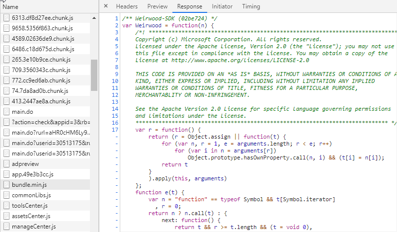

* http://links.giveawayoftheday.com/weirwood-net.com

## CASSSID

1. 使用 [cookie-edit](https://chrome.google.com/webstore/detail/editthiscookie/fngmhnnpilhplaeedifhccceomclgfbg?hl=zh-CN) 插件清除页面上所有 cookie（插件 JS 不受 http-only 影响，所以能正常清除所有 cookie）

2. 刷新页面，此时会立刻请求：https://fengchao.baidu.com/fc/toolscenter/optimize/adpreviewAndDiagnose/user/30513175/type/adpreview，查看 cookie 选项，cookie 中仍然有一个叫做 RT="xxx" 的 cookie 被发送出去。

```js
{
  name: "RT",
  value: "sl=0&ss=kjvik9jv&tt=0&bcn=https%3A%2F%2Ffclog.baidu.com%2Flog%2Fweirwood%3Ftype%3Dperf&z=1&dm=baidu.com&si=hpwj6spp0re&ul=1ft6",
  domain: ".baidu.com",
}
```

这个 cookie 从 Weirwood 的代码中刷新得来。

请求头中的 tracecode 没啥作用。

3. 请求一大堆代码资源，CSS 和 JS

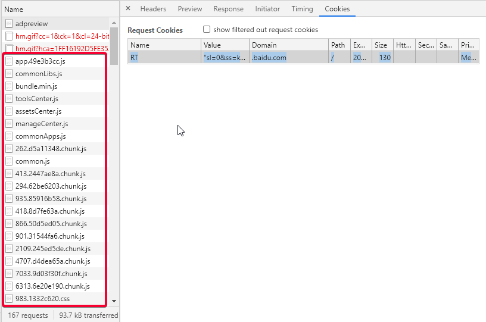

4. 请求：https://fengchao.baidu.com/hairuo/main.do，此时 RT 也被发送，但是和步骤2发送的不一样。

```js
{
  name: "RT",
  value: "sl=0&ss=kjvik9jv&tt=0&bcn=https%3A%2F%2Ffclog.baidu.com%2Flog%2Fweirwood%3Ftype%3Dperf&z=1&dm=baidu.com&si=dvnuxesoib4&ul=1ggo"
}
```

猜测是上面请求的 JS 文件又修改了 RT。

该请求为 302，设置了 __cas_id__3 等几个空值的 cookie：

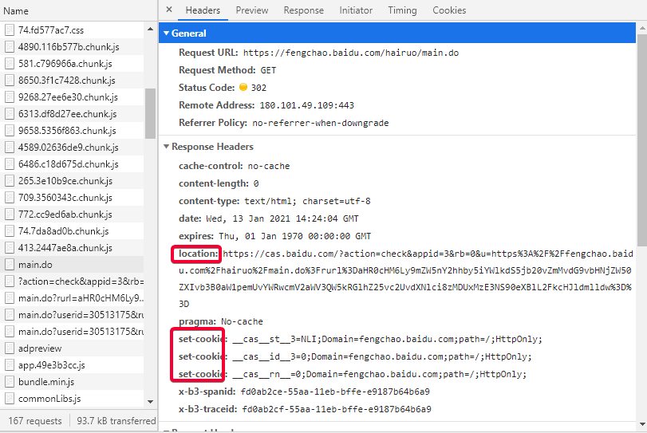

location 是重定向的地址：

* https://cas.baidu.com/?action=check&appid=3&rb=0&u=https%3A%2F%2Ffengchao.baidu.com%2Fhairuo%2Fmain.do%3Frurl%3DaHR0cHM6Ly9mZW5nY2hhby5iYWlkdS5jb20vZmMvdG9vbHNjZW50ZXIvb3B0aW1pemUvYWRwcmV2aWV3QW5kRGlhZ25vc2UvdXNlci8zMDUxMzE3NS90eXBlL2FkcHJldmlldw%3D%3D

可以看到，query 中除了 action=check，appid=3 之外，还有一个 u="https://xxxxx" 这个地址，这个地址解码得：

* https://fengchao.baidu.com/hairuo/main.do?rurl=aHR0cHM6Ly9mZW5nY2hhby5iYWlkdS5jb20vZmMvdG9vbHNjZW50ZXIvb3B0aW1pemUvYWRwcmV2aWV3QW5kRGlhZ25vc2UvdXNlci8zMDUxMzE3NS90eXBlL2FkcHJldmlldw==

其中携带一个 query rurl，即 redirect url。解密得最终我们要跳回的地址：

* https://fengchao.baidu.com/fc/toolscenter/optimize/adpreviewAndDiagnose/user/30513175/type/adpreview

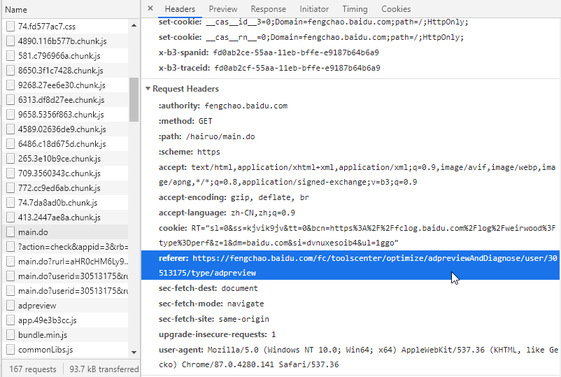

5. 请求重定向地址：https://cas.baidu.com/xxxxxxxxx，此时 cookie 是完整的（也许吧）：

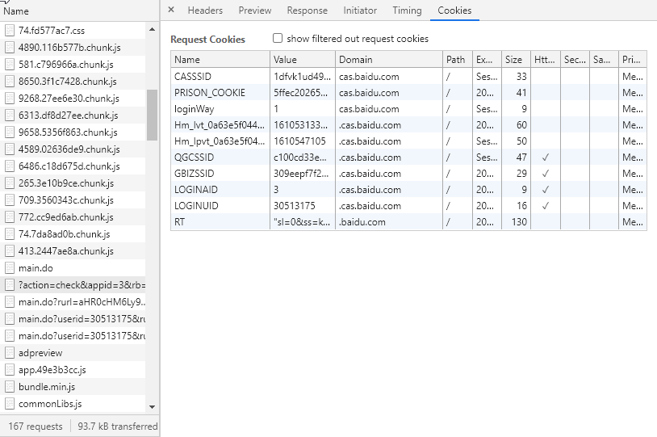

而且此时的 RT 和步骤 4 相比没有变动。

响应又是一个 302，此时 location 为：

* https://fengchao.baidu.com/hairuo/main.do?rurl=aHR0cHM6Ly9mZW5nY2hhby5iYWlkdS5jb20vZmMvdG9vbHNjZW50ZXIvb3B0aW1pemUvYWRwcmV2aWV3QW5kRGlhZ25vc2UvdXNlci8zMDUxMzE3NS90eXBlL2FkcHJldmlldw%3D%3D&castk=58d11mq7f5cf2dabfd004

此重定向地址相比步骤 4 中的重定向地址的 query.u 的 query.url 多谢带了一个 query，castk=58d11mq7f5cf2dabfd004

6. 请求重定向地址：https://fengchao.baidu.com/hairuo/main.do?xxx=xxx

RT 没变。

看起来，这个步骤就像用 castk 换到了 __cas__st__3、__cas__id__3、__cas__rn__、CPID_3、CPTK_3 这几个 cookie。其中，__cas__id__3=30513175 是百度用户ID。

__cas__st__3：94b81778ab760e287bc0b21ad02e308b285d0773d1fbd1cd54ce66ee562316facd135618e8ca5e4ada38aa62	
__cas__id__3：30513175	
__cas__rn__：0	
CPID_3：0	
CPTK_3：1934115305

响应又是一个重定向，此时 location 为：

* https://fengchao.baidu.com/hairuo/main.do?userid=30513175&rurl=aHR0cHM6Ly9mZW5nY2hhby5iYWlkdS5jb20vZmMvdG9vbHNjZW50ZXIvb3B0aW1pemUvYWRwcmV2aWV3QW5kRGlhZ25vc2UvdXNlci8zMDUxMzE3NS90eXBlL2FkcHJldmlldw%3D%3D&castk=58d11mq7f5cf2dabfd004

相比上一步，多谢带了 query.userid

7. 继续请求 main.do，又是一个重定向，重定向到自己（location 没变）。

* https://fengchao.baidu.com/hairuo/main.do?userid=30513175&rurl=aHR0cHM6Ly9mZW5nY2hhby5iYWlkdS5jb20vZmMvdG9vbHNjZW50ZXIvb3B0aW1pemUvYWRwcmV2aWV3QW5kRGlhZ25vc2UvdXNlci8zMDUxMzE3NS90eXBlL2FkcHJldmlldw%3D%3D&castk=58d11mq7f5cf2dabfd004

这个请求的 cookie 为：

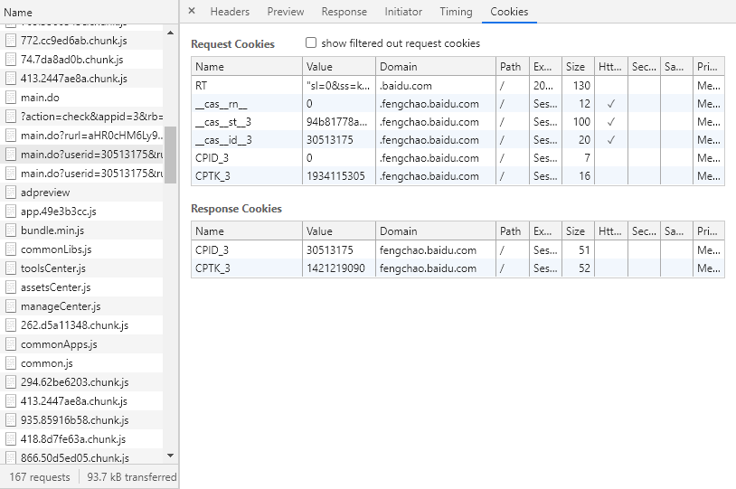

RT 没变。看起来，就像用 userid 和中间步骤的 CPTK_3 换到了正确的 CPID_3、CPTK_3

8. 继续请求 main.do，这次终于重定向到我们当时刷新的页面了：

* https://fengchao.baidu.com/fc/toolscenter/optimize/adpreviewAndDiagnose/user/30513175/type/adpreview

此时的 cookie 为此次刷新的最终的 cookie（再刷新页面，RT、BAIDUID 会变动）

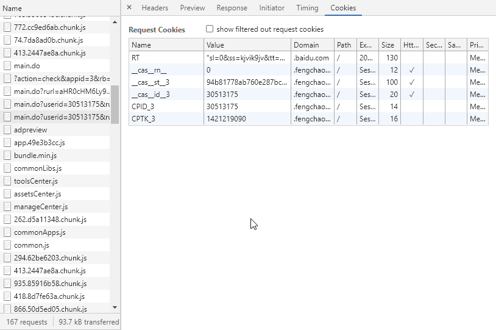

9. 类似步骤 3，请求一大堆代码资源，CSS 和 JS

10. 请求获得用户基础信息

请求地址：https://fengchao.baidu.com/hairuo/request.ajax?path=puppet%2FGET%2FBasicInfoFunction%2FgetBasicInfo&reqid=4b534c48-b47b-43f5-a2c2-161054784817

携带的 query.reqid 不知道是从哪里来的。

这次请求的 Cookie 信息如下：

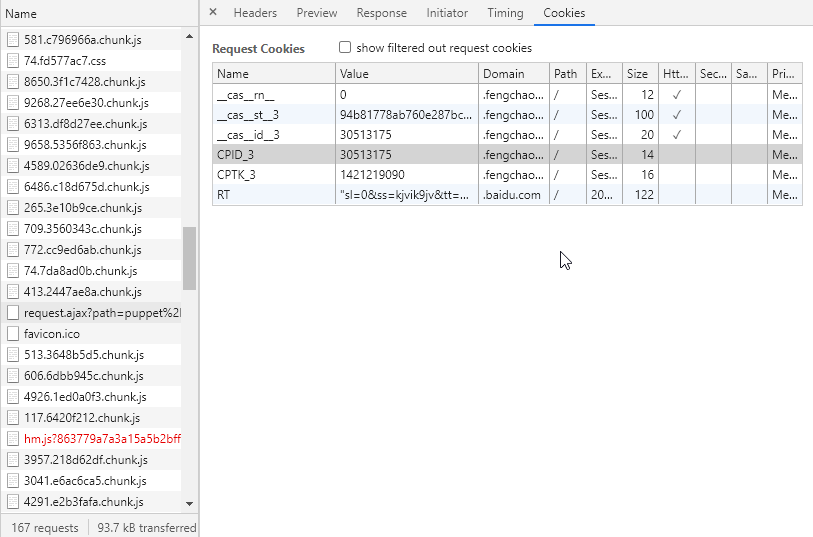

RT 变了："sl=0&ss=kjvik9jv&tt=0&bcn=https%3A%2F%2Ffclog.baidu.com%2Flog%2Fweirwood%3Ftype%3Dperf&z=1&dm=baidu.com&si=o8ysbdqddck"

11. 请求 favicon.ico（即网站 tab 页上的那个小图标），获得 Cookie BAIDUID

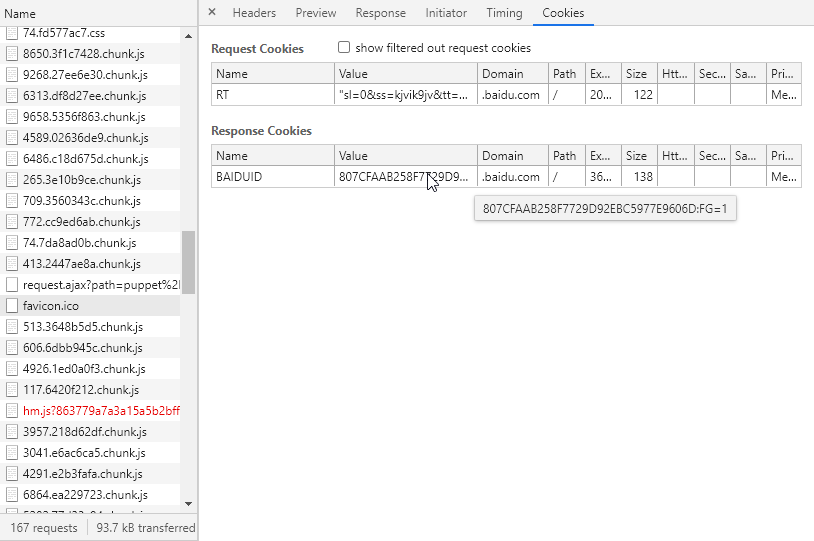

12. ---忽略这步---

13. ---忽略这步---

14. 请求用户详细信息

请求地址：https://cas.baidu.com/?controller=cc&action=getUserInfo&targetuid=30513175&jsonpcallback=__jp0

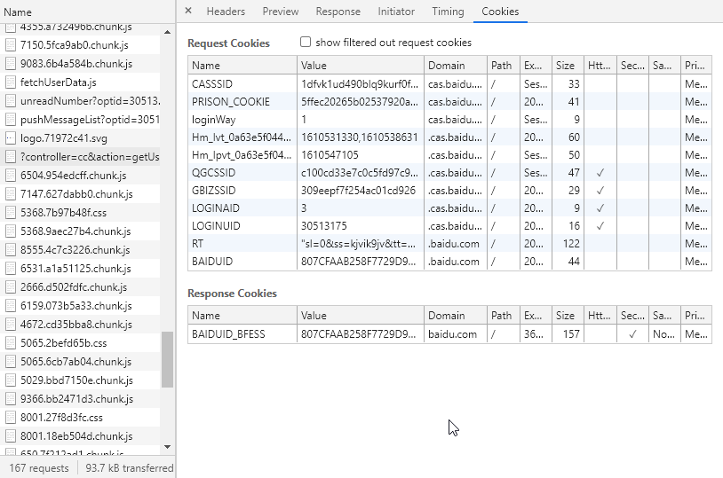

CASSSID:	1dfvk1ud490blq9kurf0fo1136
PRISON_COOKIE:	5ffec20265b02537920a4f2c0f06
loginWay:	1
Hm_lvt_0a63e5f04445be50e7e2211cc7d67abf:	1610531330
Hm_lpvt_0a63e5f04445be50e7e2211cc7d67abf:	1610547105
QGCSSID:	c100cd33e7c0c5fd97c9fc5b8a21718196cc2a38
GBIZSSID:	309eepf7f254ac01cd926
LOGINAID:	3
LOGINUID:	30513175
RT:"sl=0&ss=kjvik9jv&tt=0&bcn=https%3A%2F%2Ffclog.baidu.com%2Flog%2Fweirwood%3Ftype%3Dperf&z=1&dm=baidu.com&si=o8ysbdqddck"
BAIDUID:	807CFAAB258F7729D92EBC5977E9606D

GBIZSSID、QGCSSID 和其它发送过去的 Cookie 都不清楚哪里来的。

此时获得了 BAIDUID_BFESS 这个 Cookie（虽说值和 BAIDUID 一样）

15. 继续请求一堆 CSS 和 JS 文件

16. 请求搜索历史记录（也许吧）

请求地址：https://fengchao.baidu.com/hairuo/request.ajax?path=puppet%2FGET%2FSearchLogFunction%2FquerySearchLog&reqid=4b534c48-56e5-4e25-71f5-161054784930

这个 reqid 和获得用户基础信息那个 reqid 只有第一个短横线之前的部分，也就是 4b534c48 是一样的。

17. 会请求 map.baidu.com 记录一下 ip 地址（？）

请求地址：https://api.map.baidu.com/location/ip?ak=7Gz0oG7mHMnkw8IKVNYAibzW&callback=locationCallBack

18. 请求一个叫 getAgileQuestionToBList 的地址

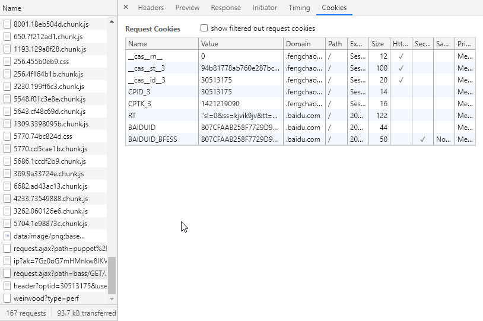

__cas__rn__:	0
__cas__st__3: 94b81778ab760e287bc0b21ad02e308b285d0773d1fbd1cd54ce66ee562316facd135618e8ca5e4ada38aa62
__cas__id__3:	30513175
CPID_3:	30513175
CPTK_3:	1421219090
RT: "sl=0&ss=kjvik9jv&tt=0&bcn=https%3A%2F%2Ffclog.baidu.com%2Flog%2Fweirwood%3Ftype%3Dperf&z=1&dm=baidu.com&si=o8ysbdqddck"
BAIDUID:	807CFAAB258F7729D92EBC5977E9606D
BAIDUID_BFESS:	807CFAAB258F7729D92EBC5977E9606D


19. 请求一个记录页面性能的接口

payload 十分大：

```
token=81857485ff1246af955079bd2dd20d9d&speedIndex=2928&c.e=kjvilq0r&c.tti.m=lt&rt.start=manual&restiming=%7B%22https%3A%2F%2F%22%3A%7B%22fengchao.baidu.com%2F%22%3A%7B%22fc%2Ftoolscenter%2Foptimize%2FadpreviewAndDiagnose%2Fuser%2F30513175%2Ftype%2Fadpreview%22%3A%226%2C29e%2C29c%2C200%2C1zx%2C1zx%2C1zx%2C1zx%2C1zx*1mi%2C-l8%2Cda%22%2C%22hairuo%2Frequest.ajax%3Fpath%3D%22%3A%7B%22puppet%252FGET%252F%22%3A%7B%22BasicInfoFunction%252FgetBasicInfo%2526reqid%3D4b534c48-b47b-43f5-a2c2-161054784817%22%3A%2252ye%2Ce4%2Cc8%2C3*1s9c%2C4f%22%2C%22SearchLogFunction%252FquerySearchLog%2526reqid%3D4b534c48-56e5-4e25-71f5-161054784930%22%3A%2253tx%2C4x%2C4v%2C3*11c%2C2b%22%7D%2C%22bass%2FGET%2FAgileToBService%2FgetAgileQuestionToBList%22%3A%2253u9%2C4k%2C4i%2C3*1y%2C2y%22%7D%7D%2C%22tuiguang-s3.bdstatic.com%2F%22%3A%7B%22windsMain%2Fstatic%2Fjs%2F%22%3A%7B%227%22%3A%7B%2209.3560343c.chunk.js%22%3A%2232pv%22%2C%2272.cc9ed6ab.chunk.js%22%3A%2232pw%22%7D%2C%229%22%3A%7B%2201.31544fa6.chunk.js%22%3A%2232pc%22%2C%2235.85916b58.chunk.js%22%3A%2232p7%22%7D%2C%2241%22%3A%7B%223.2447ae8a.chunk.js%22%3A%2232qo%2C16%22%2C%228.8d7fe63a.chunk.js%22%3A%2232p8%22%7D%2C%22262.d5a11348.chunk.js%22%3A%2232a8%22%2C%22513.3648b5d5.chunk.js%22%3A%2233cs%2C4%22%2C%22606.6dbb945c.chunk.js%22%3A%2233ct%2C5%22%2C%22866.50d5ed05.chunk.js%22%3A%2232pa%22%2C%22app.49e3b3cc.js%22%3A%22329r*24%22%7D%2C%22toolsCenter%2F%22%3A%7B%22toolsCenter.js%22%3A%2232a3%2Cdo%22%2C%22static%2F%22%3A%7B%22js%2F%22%3A%7B%222%22%3A%7B%226%22%3A%7B%225.3e10b9ce.chunk.js%22%3A%2232pu%22%2C%2266.d502fdfc.chunk.js%22%3A%2233nb%2C9%22%7D%2C%22222.b74abd29.chunk.js%22%3A%2233f5%2Cb%22%2C%22908.15a92352.chunk.js%22%3A%2233f7%2Cf%22%7D%2C%224%22%3A%7B%22589.02636de9.chunk.js%22%3A%2232pq%22%2C%22672.cd35bba8.chunk.js%22%3A%2233ne%2C9%22%2C%22890.116b577b.chunk.js%22%3A%2232pm%22%7D%2C%226%22%3A%7B%22159.073b5a33.chunk.js%22%3A%2233nc%2C1a%22%2C%22313.df8d27ee.chunk.js%22%3A%2232pp%22%2C%22486.c18d675d.chunk.js%22%3A%2232pq%22%2C%22531.a1a51125.chunk.js%22%3A%2233na%2C8%22%7D%2C%228%22%3A%7B%22555.4c7c3226.chunk.js%22%3A%2233n8%2C7%22%2C%22650.3f1c7428.chunk.js%22%3A%2232po%22%7D%2C%229%22%3A%7B%22268.27ee6e30.chunk.js%22%3A%2232po%22%2C%22658.5356f863.chunk.js%22%3A%2232pp%22%7D%2C%225065.6cb7ab04.chunk.js%22%3A%2233nm%2Cg%22%2C%227468.e0e6a559.chunk.js%22%3A%2233f8%2Cf%22%7D%2C%22css%2F5065.2befd65b.css%22%3A%2223ng%2Cc*44%22%7D%7D%2C%22assetsCenter%2FassetsCenter.js%22%3A%2232a4%2Cev%22%2C%22manageCenter%2F%22%3A%7B%22manageCenter.js%22%3A%2232a5%2Cdk%22%2C%22static%2Fjs%2F294.62be6203.chunk.js%22%3A%2232p4%22%7D%2C%22common%22%3A%7B%22Apps%2F%22%3A%7B%22commonApps.js%22%3A%2232a6%2Cej%22%2C%22static%2Fjs%2F5%22%3A%7B%2267.4ab988a7.chunk.js%22%3A%2232pi%22%2C%2281.c796966a.chunk.js%22%3A%2232pn%22%7D%7D%2C%22Libs%2F%22%3A%7B%22commonLibs.js%22%3A%2232ad%2C8%22%2C%22static%2F%22%3A%7B%22js%2F%22%3A%7B%221%22%3A%7B%221%22%3A%7B%227.6420f212.chunk.js%22%3A%2233d0%2C6%22%2C%2293.129a8f28.chunk.js%22%3A%2233nu%2Ch%22%7D%2C%22033.acbfa271.chunk.js%22%3A%2233do%2Cs%22%2C%2220.2d4cbbac.chunk.js%22%3A%2233dm%2Cf%22%2C%22309.3398095b.chunk.js%22%3A%2233o1%2Co%22%2C%22469.2e0a9103.chunk.js%22%3A%2233dn%2Ch%22%2C%22996.c5e3e861.chunk.js%22%3A%2233f6%2Cg%22%7D%2C%222%22%3A%7B%22089.a8ee43db.chunk.js%22%3A%2233f0%2C7%22%2C%22109.245ed5de.chunk.js%22%3A%2232pd%22%2C%2256.4f164b1b.chunk.js%22%3A%2233nx%2Cn%22%2C%22725.88cdd135.chunk.js%22%3A%2233dl%2Cg%22%2C%22866.c50bcfe1.chunk.js%22%3A%2233f3%2Cb%22%7D%2C%223%22%3A%7B%222%22%3A%7B%2230.199ff6c3.chunk.js%22%3A%2233ny%2Cn%22%2C%2262.060126e6.chunk.js%22%3A%2233oc%2Cu%22%7D%2C%22041.e6ac6ca5.chunk.js%22%3A%2233dc%2Ca%22%2C%22131.08c47391.chunk.js%22%3A%2233dh%2Cc%22%2C%22448.710f3673.chunk.js%22%3A%2233dj%2Ch%22%2C%2269.9a33724e.chunk.js%22%3A%2233o7%2Cu%22%2C%22790.b8242950.chunk.js%22%3A%2233fc%2Ck%22%2C%22957.218d62df.chunk.js%22%3A%2233db%2C6%22%7D%2C%224%22%3A%7B%222%22%3A%7B%2233.73549888.chunk.js%22%3A%2233oa%2Cv%22%2C%2291.e2b3fafa.chunk.js%22%3A%2233dd%2Ca%22%7D%2C%22355.a732496b.chunk.js%22%3A%2233fe%2Ck%22%2C%22589.e9f8e86e.chunk.js%22%3A%2233f1%2Cs%22%2C%22707.d4dea65a.chunk.js%22%3A%2232pe%22%2C%22926.1ed0a0f3.chunk.js%22%3A%2233d0%2C4%22%7D%2C%225%22%3A%7B%220%22%3A%7B%2229.bbd7150e.chunk.js%22%3A%2233no%2C9%22%2C%2267.2a81d0cb.chunk.js%22%3A%2233fu%2Cc%22%7D%2C%222%22%3A%7B%2202.77d33c94.chunk.js%22%3A%2233dg%2Cc%22%2C%2233.0f6b7bcb.chunk.js%22%3A%2233fd%2Ck%22%7D%2C%223%22%3A%7B%2203.07ed7e84.chunk.js%22%3A%2233f0%2C8%22%2C%2268.9aec27b4.chunk.js%22%3A%2233mj%2Ce%22%7D%2C%226%22%3A%7B%2243.cf48c69d.chunk.js%22%3A%2233o0%2Cn%22%2C%2286.1ccdf2b9.chunk.js%22%3A%2233o5%2Cv%22%7D%2C%227%22%3A%7B%2204.1e98873c.chunk.js%22%3A%2233od%2Cu%22%2C%2270.cd5cae1b.chunk.js%22%3A%2233o4%2Cv%22%7D%2C%22548.f01c3e8e.chunk.js%22%3A%2233nz%2Co%22%7D%2C%226%22%3A%7B%223%22%3A%7B%2213.6e20e190.chunk.js%22%3A%2232pf%22%2C%2235.dabade92.chunk.js%22%3A%2233fb%2Ce%22%7D%2C%228%22%3A%7B%2241.4bc4623c.chunk.js%22%3A%2233f9%2Ce%22%2C%2264.ea229723.chunk.js%22%3A%2233de%2Cd%22%7D%2C%2250%22%3A%7B%224.954edcff.chunk.js%22%3A%2233mg%2C8%22%2C%22.7f212ad1.chunk.js%22%3A%2233ns%2Cg%22%7D%2C%22214.4c6c5a25.chunk.js%22%3A%2233du%2Cs%22%2C%22486.888c953e.chunk.js%22%3A%2233dr%2Cr%22%2C%22682.ad43ac13.chunk.js%22%3A%2233o8%2Ct%22%7D%2C%227%22%3A%7B%221%22%3A%7B%2247.627dabb0.chunk.js%22%3A%2233mh%2C8%22%2C%2250.5fca9ab0.chunk.js%22%3A%2233ff%2Cj%22%7D%2C%22033.9d03f30f.chunk.js%22%3A%2232pf%22%2C%22206.41912890.chunk.js%22%3A%2233dn%2Cr%22%2C%22328.39ebe445.chunk.js%22%3A%2233fb%2Ce%22%2C%224.7da8ad0b.chunk.js%22%3A%2232px%22%7D%2C%228%22%3A%7B%22001.18eb504d.chunk.js%22%3A%2233nr%2Ch%22%2C%2235.997b99b9.chunk.js%22%3A%2233e0%2Cr%22%2C%22517.176e1941.chunk.js%22%3A%2233dt%2Cq%22%7D%2C%229%22%3A%7B%22083.6b4a584b.chunk.js%22%3A%2233ff%2Ck%22%2C%22366.bb2471d3.chunk.js%22%3A%2233np%2Ca%22%2C%22435.e56d6f5c.chunk.js%22%3A%2233dq%2Cq%22%2C%22714.0c6f6e0b.chunk.js%22%3A%2233ds%2Cp%22%2C%2283.12392010.chunk.js%22%3A%2232ph%22%7D%7D%2C%22css%2F%22%3A%7B%225%22%3A%7B%22368.7b97b48f.css%22%3A%2223mi%2Ce*44%22%2C%22770.74bc824d.css%22%3A%2223o2%2Co*44%22%7D%2C%228%22%3A%7B%22001.27f8d3fc.css%22%3A%2223nq%2Ch*44%22%2C%2235.396d5d4a.css%22%3A%2223dy%2Cr*44%22%7D%2C%221996.a412aaee.css%22%3A%2223ez%2C6*44%22%2C%22256.455b0eb9.css%22%3A%2223nv%2Co*44%22%2C%2274.fd577ac7.css%22%3A%2222pn*44%22%2C%22983.1332c620.css%22%3A%2222pg*44%22%7D%2C%22media%2Flogo.71972c41.svg%22%3A%22*0w%2C49%2Cg%2Cw%2Cn%2C49%7C13m2%22%7D%7D%7D%7D%2C%22www.baidu.com%2Ffavicon.ico%22%3A%2202zu%2Cdd%22%2C%22mishu.baidu.com%2Fpublic%2F%22%3A%7B%22message%2F%22%3A%7B%22unreadNumber%3Foptid%3D30513175%2526userid%3D30513175%2526from%3D1%2526callback%3DsuperagentCallback1610547849723%22%3A%2233id%2C84%22%2C%22pushMessageList%3Foptid%3D30513175%2526userid%3D30513175%2526from%3D1%2526callback%3DsuperagentCallback1610547849580%22%3A%2233ig%2C80%22%7D%2C%22show%2Fheader%3Foptid%3D30513175%2526userid%3D30513175%2526source%3D2_3_1%2526type%3D1%2526callback%3DsuperagentCallback1610547849432%22%3A%2233wb%2C48%22%7D%2C%22cas.baidu.com%2F%3Fcontroller%3Dcc%2526a%22%3A%7B%22ction%3DgetUserInfo%2526targetuid%3D30513175%2526jsonpcallback%3D__jp0%22%3A%2233md%2C42%22%7D%2C%22api.map.baidu.com%2Flocation%2Fip%3Fak%3D7Gz0oG7mHMnkw8IKVNYAibzW%2526callback%3DlocationCallBack%22%3A%2233tz%2C6*21%22%7D%7D&userId=30513175&spa.missed=1&c.tti.xd=5141.814999980852&rt.bmr=2951%2C421%2C420%2C3&rt.tstart=1610547844347&rt.bstart=1610547847725&rt.end=1610547849488&t_resp=2928&t_page=2213&t_done=5141&t_other=boomerang%7C2787%2Cboomr_fb%7C3378&u=https%3A%2F%2Ffengchao.baidu.com%2Ffc%2Ftoolscenter%2Foptimize%2FadpreviewAndDiagnose%2Fuser%2F30513175%2Ftype%2Fadpreview&http.initiator=spa_hard&rt.tt=5141&rt.obo=0&pt.fp=3535&pt.fcp=4374&nt_nav_st=1610547844347&nt_fet_st=1610547846936&nt_dns_st=1610547846936&nt_dns_end=1610547846936&nt_con_st=1610547846936&nt_con_end=1610547846936&nt_req_st=1610547846938&nt_res_st=1610547847275&nt_res_end=1610547847276&nt_domloading=1610547847282&nt_domint=1610547847307&nt_domcontloaded_st=1610547847307&nt_domcontloaded_end=1610547847307&nt_domcomp=1610547848177&nt_load_st=1610547848177&nt_load_end=1610547848177&nt_ssl_st=1610547846936&nt_enc_size=810&nt_dec_size=1288&nt_trn_size=46&nt_protocol=h2&nt_first_paint=1610547847882&nt_red_cnt=0&nt_nav_type=0&c.tti.vr=4375&c.tti=4885&r=https%3A%2F%2Ffengchao.baidu.com%2Ffc%2Ftoolscenter%2Foptimize%2FadpreviewAndDiagnose%2Fuser%2F30513175%2Ftype%2Fadpreview&v=%25boomerang_version%25&sm=i&rt.si=o8ysbdqddck-qmvmm8&rt.ss=1610547776347&rt.sl=1&vis.st=visible&ua.plt=Win32&ua.vnd=Google%20Inc.&pid=tbazso6s&n=1&c.lt.n=4&c.lt.tt=435.27499996707775&c.lt=%5B%7B%22s%22%3A%222s6%22%2C%22d%22%3A%2268%22%2C%22n%22%3A1%2C%22a%22%3A%5B%7B%22a%22%3A0%2C%22t%22%3A0%2C%22s%22%3A%22%22%7D%5D%7D%2C%7B%22s%22%3A%223gf%22%2C%22d%22%3A%2221%22%2C%22n%22%3A1%2C%22a%22%3A%5B%7B%22a%22%3A0%2C%22t%22%3A0%2C%22s%22%3A%22%22%7D%5D%7D%2C%7B%22s%22%3A%223jy%22%2C%22d%22%3A%221z%22%2C%22n%22%3A1%2C%22a%22%3A%5B%7B%22a%22%3A0%2C%22t%22%3A0%2C%22s%22%3A%22%22%7D%5D%7D%2C%7B%22s%22%3A%223qv%22%2C%22d%22%3A%221w%22%2C%22n%22%3A1%2C%22a%22%3A%5B%7B%22a%22%3A0%2C%22t%22%3A0%2C%22s%22%3A%22%22%7D%5D%7D%5D&c.f=97&c.f.d=3283&c.f.m=1&c.f.l=5&c.f.s=kjvilsms&sb=1
```