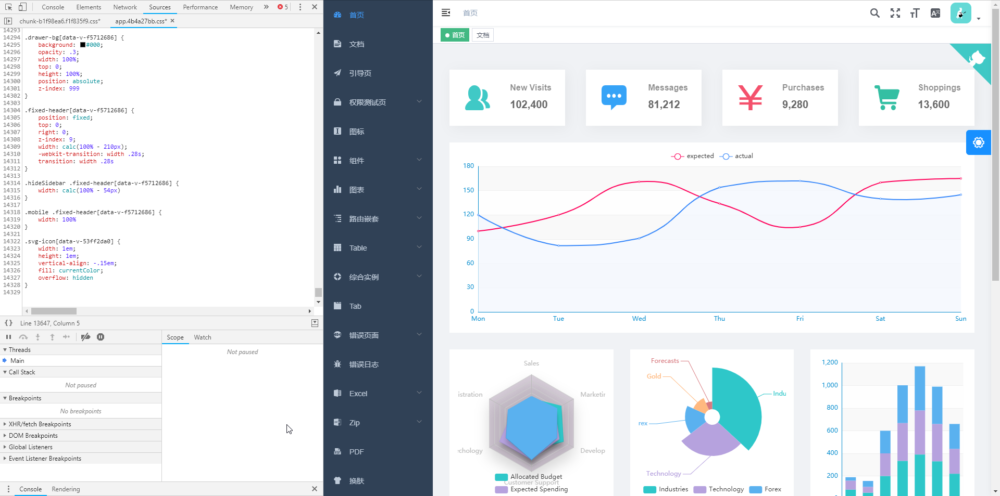

# [深入探索] VueJS Scoped CSS 实现原理

使用VueJS进行应用开发, 脱离不了对应用间的模块进行拆分, 将大块界面拆解为组件的过程. 
我们可以很方便的在单文件中使用`<template>`块维护组件的视图, 使用`<script>`维护组件的逻辑部分, 使用`<style>`维护组件的样式.
在我们编写VueJS组件样式时, 不得忽略的一点就是如何防止以及反制样式污染.

## 样式污染产生原因

提及样式污染, 主要要追溯到`Webpack`对`CSS`文件的打包过程, 这里我们以[`Vue-Element-Admin`](https://github.com/PanJiaChen/vue-element-admin)中的Webpack配置项举例:

```JS
const webpackConfig = merge(baseWebpackConfig, {
	plugins: [
		new MiniCssExtractPlugin({
          filename: utils.assetsPath('css/[name].[contenthash:8].css'),
          chunkFilename: utils.assetsPath('css/[name].[contenthash:8].css')
        }),
	]
})
```

Webpack 使用 `MiniCssExtractPlugin` 插件, 将文件(如Vue单文件组件)中的CSS代码, 经过处理后, 分离到形如`app.hash1234.css`的单独的CSS文件:



如果没有加入防止样式污染的措施的同时, 项目中存在了大量的同名ClassName, 那么可能会产生意想不到的CSS选择器权重覆盖. 这可能使后文件中某部分选择器权重更高的类影响整个应用, 而此过程通常发生在组件的编写中, 所以一般称之为组件样式污染.

## Webpack & Vue SFC Object

对于 Vue 项目而言, 使用 Webpack 将极大的优化了工作流程, 因为通过`Vue Loader`, Vue 单文件组件能很好的融合进 Webpack 工作流中.
通过跟踪源码, 可以发现, 我们写的单文件组件都被处理为了`SFC对象`, 即包含了单个HTML模块, 单个脚本模块, 一个或多个样式模块, 一个或多个自定义模块的对象:

```js
// vue-loader/index.js
const descriptor = parse({
    source,
    compiler: options.compiler || loadTemplateCompiler(),
    filename,
    sourceRoot,
    needMap: sourceMap
})

// vuejs/component-compiler-utils/index.js
function parse(options) {
    const { compiler } = options
    output = compiler.parseComponent(source, compilerParseOptions)
    return output
}

// vue.js
function parseComponent(content, options) {
    // ...
    var sfc = {
        template: null,
        script: null,
        styles: [],
        customBlocks: []
    }
    // ...
    return sfc
}
```

我们可以将SFC结构融合到`Webpack`进行开发的过程成中, 主要有这几点影响:

- 允许为 Vue 组件的每个部分使用其它的 webpack loader，例如在`<style>`的部分使用 Sass Loader , 在 `<customBlocks>`的部分使用自定义 Loader
- 使用 webpack loader 将 `<style>`和 `<template>` 中引用的资源当作模块依赖来处理
- 模拟 Scoped CSS
- 在开发过程中使用热重载来保持状态

以下主要介绍`Scoped CSS`的原理.

## Scoped CSS

### 大白话版本之 Scoped CSS 原理

通过 Webpack 调用 VueJS 中相应 Loader , 给组件HTML模板添加自定义属性 (Attribute) `data-v-x`, 以及给组件内CSS选择器添加对应的属性选择器 (Attribute Selector) `[data-v-x]`, 达到组件内样式只能生效与组件内HTML的效果, 代码效果如下:

```HTML
<div class='lionad' data-v-lionad></div>
<style>
.lionad[data-v-lionad] {
  background: @tiger-orange;
}
</style>
```

### 源码跟踪

Webpack 使用其它 CSS Loader 处理 VueJS 中对应 CSS 代码之前, `Vue Loader` 已经替我们做了一层简单的处理, 如果组件中 `style` 块包含了 `scoped` 属性:

``` HTML
<!-- 某个VueJS组件中 -->
<template>
    <div class='lionad'></div>
</template>
<style lang="scss" scoped>
    .lionad {
        background: @tiger-orange;
    }
</style>
```

下代码即判断当前`SFC`对象样式块中是否有`scoped`属性, 并插入用于 query 中, 顺带一提, 每个单文件组件被解析后, 都会生成对应组件ID, ID主要以生产/开发环境做区分, 通过文件路径+源码或是文件路径的值作为哈希特征值的形式生成, 如下:

``` JS
// vue-loader/index.js
const id = hash(isProduction  (shortFilePath + '\n' + source) : shortFilePath)
const hasScoped = descriptor.styles.some(s => s.scoped)
const query = `? vue&type=template${idQuery}${scopedQuery}`
const request = templateRequest = stringifyRequest(src + query)
templateImport = `import { render, staticRenderFns } from ${request}`
```

#### HTML模板处理

在用于处理SFC结构中HTML模板的 `templateLoader` 中, 我们可以得知, query 中所设置的参数将合并为 loader options 经由 Webpack  转交 `templateLoader` 再转交 `@vue/component-compiler-utils.compileTemplate` 处理:

```JS
// vue-loader/templateLoader.js
const query = qs.parse(this.resourceQuery)
const { id } = query
const compilerOptions = Object.assign({}, options.compilerOptions, {
    scopeId: query.scoped ? `data-v-${id}` : null
})
const compiled = compileTemplate({ compilerOptions })
```

实际 `compileTemplate` 函数在处理内容时, 编译函数使用的是 query 中的 compiler 或 `vue-template-compiler`, 后者会将模板文本转换成为 JavaScript 渲染函数, 大致如下:

1. 从HTML模版转换为AST(虚拟语法树)
2. AST优化，处理静态模版与动态模板
3. 生成JS函数，用于在运行时运行时生成纯HTML

代码分别对应:

```JS
// vue-template-compiler/build.js/createCompilerCreator
var ast = parse(template.trim(), options)
optimize(ast, options)
var code = generate(ast, options)
```

先前我们的组件ID在 parse 阶段解析开始标签时就会被推入内部储存的数据结构中:

```JS
function elementToOpenTagSegments (el, state) {
  var segments = [{ type: RAW, value: ("<" + (el.tag)) }]
  // _scopedId
  if (state.options.scopeId) {
    segments.push({ type: RAW, value: (" " + (state.options.scopeId)) })
  }
  segments.push({ type: RAW, value: ">" })
  return segments
}
```

先前我们的HTML模板 `<div class='lionad'></div>` 中开始标签会被转换成如下数据结构:

```JS
[
    { type: RAW, value: '<div' },
    { type: RAW, value: 'class=lionad' },
    { type: RAW, value: 'data-v-xxxxxx' },
    { type: RAW, value: '>' },
]
```

#### 样式模板处理

与 HTML Template 解析的过程类似, 通过 Webpack 将样式模板转交 `stylePostLoader` 进行处理, 处理逻辑主要引用了 `@vue/component-compiler-utils` 中的 `compileStyle` 部分, 后者对样式模板进行解析的过程中, 将会对含 scoped 标记的模板引入插件 `stylePlugins/scoped.js`:

```JS
// component-compiler-utils/compileStyle.js
function doCompileStyle (options) {
    if (scoped) {
        plugins.push(scoped_1.default(id));
    }
    return { result: postcss(plugins).process(source, postCSSOptions) }
}
```

插件 `scoped.js` 将 `data-v-xxxxxx` 添加到选择器末尾的具体逻辑如下, 遍历每一个选择器组合下的选择器, 选择给每个组合下最后一个选择器的末尾插入:

```JS
// component-compiler-utils/stylePlugins/scoped.js
selectors.each((selector) => {
    selector.each((n) => {
        if (n.value === '::v-deep' || n.value === '>>>' || n.value === '/deep/') {
            return false;
        }
    });
    selector.insertAfter(node, selectorParser.attribute({
        attribute: id
    }))
})
```

题外话, 通过以上代码, 我们发现当当前处理到三种特定类型选择器会终止循环, 停止将 `data-v-xxx` 添加到选择器末尾:

1. 伪类 `::v-deep`
2. 选择器 `>>>`
3. 选择器 `/deep/`

我们可以利用这个特征, 在组件中写样式穿透, 即内部组件影响外部组件样式 (ε=ε=ε=┏(゜ロ゜;)┛ 主动样式污染), 当然这在特定的情境下是有用的, 比如当我们想主动覆盖第三方UI组件框架的样式, 却不想引入新的CSS文件, 或不想写非 Scoped CSS 模板的时候.

## 最后

本人前端菜得捉急, 文中不详尽或有错的地方, 欢迎各位大佬斧正. 如果本文对你有所帮助, 那是再好不过, 看到这里都是真爱啊(笑.jpg) 劳烦`点赞 收藏 关注 三连击`!!!

> 为了方便理解, 或是防止陷入令人头疼的细节, 文中源码片段有部分删减
