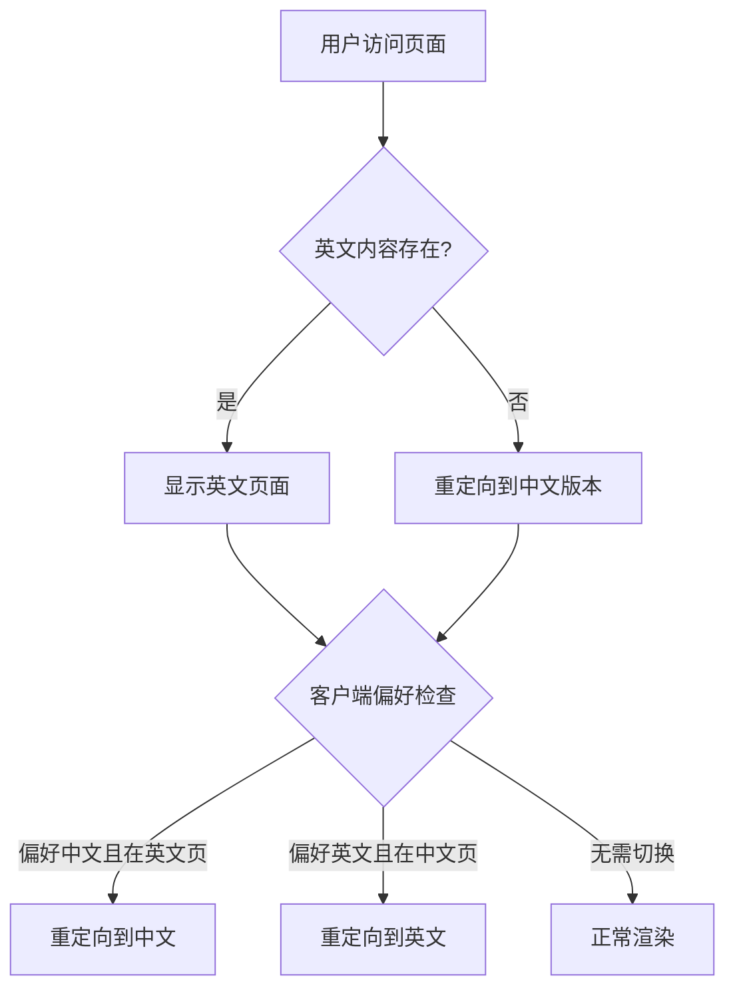

## 概述

轻量级 i18n 方案，不依赖第三方库：

| 设计点 | 实现 |
|--------|------|
| 默认语言 | 中文 |
| 路径约定 | 中文在根路径，英文在 `/en/` 前缀 |
| 偏好存储 | localStorage |
| 自动切换 | 中间件根据偏好重定向 |

## 文件结构

```
content/
├── index.yml              # 首页（中文）
├── 2.articles/
│   └── xxx.md            # 文章（中文）
├── en/                    # 英文内容
│   └── 2.articles/
│       └── xxx.md
└── ...
```

## 核心模块

### 工具函数 (`utils/locale.ts`)

```ts
getLocaleFromPath(path: string): 'zh' | 'en'  // 从路径识别语言
stripEnPrefix(path: string): string           // 移除 /en 前缀
withLocalePath(locale, basePath): string      // 添加语言前缀
```

### 状态管理 (`composables/usePreferredLocale.ts`)

```ts
usePreferredLocale(): Ref<'zh' | 'en'>  // 响应式语言偏好，自动持久化到 localStorage
```

### 路由中间件 (`middleware/locale-preference.global.ts`)



### 页面组件 (`pages/[...slug].vue`)

语言切换下拉菜单，仅当英文版本存在时显示。

## 数据流

```mermaid
sequenceDiagram
    participant U as 用户
    participant M as 中间件
    participant C as Content API
    participant P as 页面组件

    U->>M: 访问 /en/articles/xxx
    M->>C: 查询英文内容
    C-->>M: 存在/不存在
    alt 英文不存在
        M->>U: 重定向到 /articles/xxx
    else 英文存在
        M->>P: 渲染页面
        P->>U: 显示内容 + 语言切换按钮
    endYou you.
```

## 注意事项

| 问题 | 解决方案 |
|------|----------|
| 内容 404 | 中间件使用 try-catch 处理查询失败 |
| SSR 兼容 | localStorage 仅在 `process.client` 时访问 |
| 状态同步 | 使用 `useState` 确保 SSR/CSR 一致 |
| 渐进增强 | 无英文版本时中文正常显示 |
| 内部路由 | 中间件跳过 `/_` 和 `/api/` 开头的路径 |

## SEO 配置

### hreflang 标签

页面自动生成 hreflang 标签（仅当英文版本存在时）：

```html
<link rel="alternate" hreflang="zh" href="https://lionad.art/articles/xxx" />
<link rel="alternate" hreflang="en" href="https://lionad.art/en/articles/xxx" />
<link rel="alternate" hreflang="x-default" href="https://lionad.art/articles/xxx" />
```

### 搜索引擎影响

| 搜索引擎 | 说明 |
|----------|------|
| Google | 支持 hreflang，正确索引多语言版本 |
| Baidu | 不支持 hreflang，依赖内容语言检测 |
| AI 搜索 | 可能索引英文版本，机翻质量影响可信度 |

### RSS 订阅

RSS 配置只匹配中文路径，**不包含英文翻译版本**：

```ts
// nuxt.config.ts
where: [{ _path: /^\/(articles|flows)\/([^_]|(_forty-two))/ }]
```

## Agent 行为指南

- 修改内容时考虑是否同步更新另一语言版本
- 路径处理使用 `utils/locale.ts` 工具函数
- 新增页面时如需英文版本，在 `content/en/` 下创建对应文件
- 英文内容为机器翻译，UI 标识为 `EN*`
