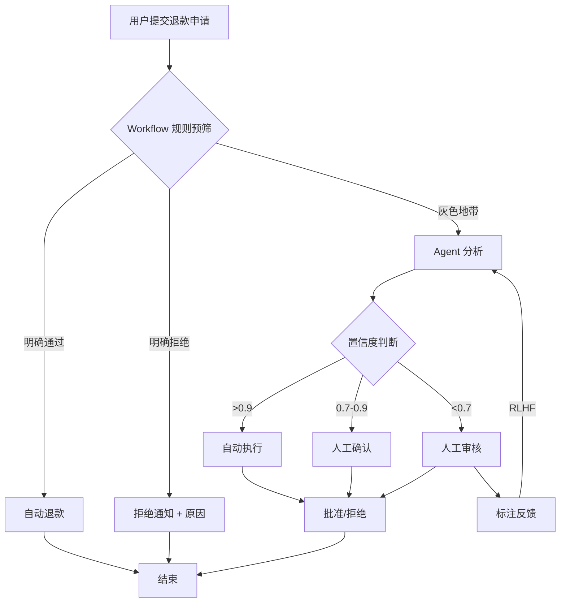

## 问题场景

某电商公司需要处理售后退款申请，面临两种技术方案选择：

**方案A：Workflow（固定流程）**

| 规则维度 | 处理逻辑 |
|----------|----------|
| 一般商品 + 7天内 + <100元 | 自动通过 |
| 一般商品 + 7天内 + 100-500元 | 客服审核 |
| 一般商品 + 7天内 + >500元 | 主管审批 |
| 特殊商品（定制品） | 一律拒绝 |
| 超7天商品 | 仅客服审核或主管审批 |

**优点**：
- 决策路径完全透明，审计合规性强
- 实施简单，1-2周可上线
- 标准化响应快（自动通过的秒级响应）
- 财务审批链清晰，责任明确

**缺点**：
- 无法处理规则外边缘情况（"卡死"在流程中）
- 维护成本高，每新增品类/活动都需改代码
- 可能拒绝合理例外请求（如忠实客户小额超期退款）
- 客户感知"死板"，缺乏情感温度

**方案B：Agent（智能体决策）**

Agent 理解退款政策、分析用户历史行为、评估商品状况，自主决策是否批准。

**优点**：
- 能理解上下文，处理复杂例外组合（如"老客户+质量问题+超期"）
- 可识别高价值客户并灵活处理（如 VIP 自动通过超期退款）
- 从历史数据学习，策略越用越"聪明"
- 能识别欺诈模式的多维关联

**缺点**：
- 决策黑箱，可能无法解释"为什么拒绝"
- 可能产生偏见（对某些用户群体不公平）
- 冷启动问题，初期决策质量不稳定
- 幻觉风险（可能批准明显违规的退款）
- 前期投入大（数据标注、模型训练、安全对齐）

**方案C：混合架构**

### 核心设计思想

> "Workflow 作为安全护栏，Agent 作为决策大脑，人作为最终裁判"

### 分层决策架构

```
┌─────────────────────────────────────────────────────────────────┐
│  Layer 1: 规则预筛（Workflow 硬规则）—— 快速通道                  │
│  ┌───────────────────────────────────────────────────────────┐  │
│  │  绝对通过：一般商品 + 7天内 + 金额<100 + 用户信用良好        │  │
│  │  绝对拒绝：定制品 + 已使用 + 无质量问题                      │  │
│  │  → 这类订单直接处理，不经过 AI，占总量 60-70%               │  │
│  └───────────────────────────────────────────────────────────┘  │
│                              │                                   │
│                              ▼                                   │
│  Layer 2: Agent 决策（灰色地带）—— 智能判断                       │
│  ┌───────────────────────────────────────────────────────────┐  │
│  │  复杂情况输入 Agent：                                        │  │
│  │  • 超期但客户是老用户 + 商品确实有问题                       │  │
│  │  • 金额>500但客户历史退货率低 + 理由合理                     │  │
│  │  • 新用户 + 高金额 + 理由模糊（需判断是否为欺诈）            │  │
│  │                                                             │  │
│  │  Agent 分析维度：                                            │  │
│  │  • 用户画像（历史订单、退货率、信用分）                      │  │
│  │  • 商品特征（类别、保质期、是否易损）                        │  │
│  │  • 退款理由（NLP 情感分析、与商品描述匹配度）                │  │
│  │  • 上下文（是否大促期间、是否库存积压可退）                  │  │
│  │                                                             │  │
│  │  Agent 输出：置信度 + 建议（批准/拒绝/人工审核）+ 理由摘要    │  │
│  └───────────────────────────────────────────────────────────┘  │
│                              │                                   │
│                              ▼                                   │
│  Layer 3: 人工兜底（Human-in-the-loop）                          │
│  ┌───────────────────────────────────────────────────────────┐  │
│  │  触发条件：                                                  │  │
│  │  • Agent 置信度 < 0.7（不确定）                              │  │
│  │  • Agent 与 Workflow 规则冲突                                │  │
│  │  • 客户申诉（对 Agent 决策不满）                             │  │
│  │                                                             │  │
│  │  人工审核后反馈给 Agent（RLHF 强化学习）                     │  │
│  └───────────────────────────────────────────────────────────┘  │
└─────────────────────────────────────────────────────────────────┘
```

### 关键机制

| 机制 | 说明 | 解决的问题 |
|------|------|------------|
| **置信度阈值** | Agent 输出置信度>0.9 自动执行，0.7-0.9 人工确认，<0.7 转人工 | Agent 幻觉风险 |
| **规则覆盖** | Workflow 硬规则永远优先于 Agent 建议 | 合规底线 |
| **人机回环（RLHF）** | 人工审核结果实时反馈训练 Agent | Agent 持续优化 |
| **熔断降级** | Agent 服务故障时全自动降级为 Workflow | 系统可用性 |
| **可解释性** | Agent 必须输出决策理由 | 客服可解释 |

### 数据流图



## 决策建议

| 维度 | Workflow (A) | Agent (B) | 混合方案 (C) |
|------|--------------|-----------|--------------|
| **适用阶段** | 初创期/稳定期 | 成熟期/复杂业务 | 成长期/过渡期 |
| **实施周期** | 1-2周 | 3-6个月 | 2-3周（MVP）+ 持续优化 |
| **初期准确率** | 80%（规则覆盖内） | 60-70%（冷启动） | 80%（Workflow 兜底） |
| **长期天花板** | 85%（规则碎片化） | 90%+（数据驱动） | 90%+（人+机协同） |
| **合规可控** | ⭐⭐⭐⭐⭐ | ⭐⭐⭐ | ⭐⭐⭐⭐ |
| **灵活性** | ⭐⭐ | ⭐⭐⭐⭐⭐ | ⭐⭐⭐⭐ |
| **客户体验** | ⭐⭐⭐ | ⭐⭐⭐⭐⭐ | ⭐⭐⭐⭐ |
| **实施成本** | 低 | 高 | 中 |

**推荐**：除非公司有充足 AI 技术储备且业务极度复杂，否则**优先选择方案 C（混合架构）**，以 Workflow 建立安全基线，逐步引入 Agent 提升智能化水平。
