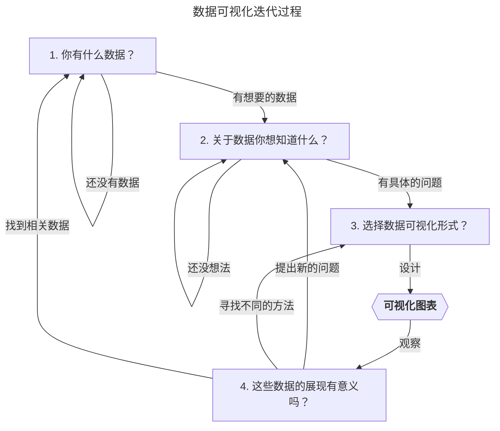

信息设计包含两个重要的概念：设计以及信息。即研究如何展示信息。

不仅是"展示"，也许换个词"呈现"，意思更加确切一些，因为设计工作中，我们不仅仅只面向形状、色彩、容器等信息的视觉映像，通常还会涉及视角、情绪、隐喻等心理层面因素。比方说，字体衬线体的古典对比非衬线体的现代感；文字的严肃对比图文的冲击力；黑白的冷淡对比红色的热情。

可以发现，所有信息都会经过设计（设计师）的诠释，后者将其中关建以及内涵（理想、信念）"呈现"给其他人。所以，不论是你闲下来在看的博客、工作日使用的汽车还是街道上的路牌。.. 所有信息都需要设计，最终目标是使清晰、准确而高效的传达。

评价设计的好坏，一般来说，总是围绕着"传达"这个关键点。但"传达"是困难的，设计师站在信息和受众两者中间，为将深奥复杂的信息（甚至缺失）转化能被受众理解的玩意儿花尽了心思，仍然常导向设计失败的结果，也就是我们经常听到"难懂无趣"、"晕"、"欺骗"等指摘。当然，我们总能找到许多反例，比如戴维·卡森设计的杂志封面就要求你必须花费比较多的力气来理解他传达的信息。这显然也是一种"传达"（带有强烈的戴维·卡森风格），就看你是不是他的受众啦。

信息设计也是有难度的。一方面，困扰设计师的问题可能是信息过载、缺失、深奥或无意义；另一方面，信息的真和假也常常被拿出来大加讨论。可以想象，设计师不仅要做一个"人肉翻译器"，用高超的理解力清洗并转换数据，他还需承担设计带来的"道德风险"。也就是说，信息本身在转换的过程中，它也在真与假的模糊中丢失了身影。

#### 多个分组之间怎么对比？

使用柱状图能很好的展示数据在某个维度上的变化趋势，当分组数量变成两个时，也可以在一张图中较为清晰地展示多个分组之间的对比。

但是当分组数量急速上升时，使用山脊线图（Ridge Plot）可能是一个更好的选择。

见：[Ridgeline Plots to Depict Multiple Distributions](https://blog.dailydoseofds.com/p/ridgeline-plots-to-depict-multiple)

#### ISUX 遇见大数据可视化系列

* [未来已来，变革中的数据可视化](https://isux.tencent.com/articles/91.html)
* [数据可视化基础研究](https://isux.tencent.com/articles/90.html)
* [来做一个数据可视化报表](https://isux.tencent.com/articles/89.html)
* [可视化系统搭建](https://isux.tencent.com/articles/79.html)
* [数据图表设计（一）](https://isux.tencent.com/articles/78.html)

<q>世界上 90％的数据是在过去几年内产生的事实上，过去三十年中，全世界的数据量大约每两年增加 10 倍。</q>

因为数据多且增量大，所以需要持续改进可视化形式。技术上来说，可视化形式逐渐从从过去的表格、信息图、图表，逐渐扩充了交互图表、VR 图表等形式。

* [图表可视化发展史](https://www.datavis.ca/milestones/)

<q>大数据时代的数据可视化具有哪些特征，笔者大概将其整理归纳为以下三点。</q>

- 直观：使用 3D、动效等加强视觉冲击增强图表的可认知性
- 交互：通过互动改变数据的表现形式
- 实时：在庞大的数据量及增量的背景下，数据的实时性尤为重要

<q>为什么人们会对信息图的传播内容更有效的认知呢？</q>

主要原因是因为视觉是人类最强的信息输入方式，其次，信息图提供了特定的语境，能展示多个维度数值并且相互比较。

<q>信息图的分类也逐步划分为：图解（Diagram） 、图表（Chart） 、 表格（Table） 、统计图（Graph） 、 地图（Map）和图形符号（Pictogram）这几部分。</q>

- 图解 Diagram：主要运用插图对事物进行说明
- 图表 Chart：运用图形、线条及插图等，阐明事物的相互关系
- 表格 Table：根据特定信息标准进行区分，设置纵轴与横轴
- 统计图 Graph：通过数值来表现变化趋势或进行比较
- 地图 Map：描述在特定区域和空间里的位置关系
- 图形符号 Pictogram：不使用文字，运用图画直接传达信息

<q>我们来看一个数据：2017 年 1 月 28 号，成都 PM2.5 值 245，从这个数据里能看出什么</q>

作者通过这个例子展现了收集、清洗、设计这三个完整的流程。他先从环境检测总站获取了 1 月份的检测信息，清洗后获得整个月的 PM2.5 值，通过将 PM2.5 映射成天空的照片，最后线性排开。从最后的图表中可以准确并清晰的确认 1 月份中的好天气。

<q>数据可视化迭代过程</q>

